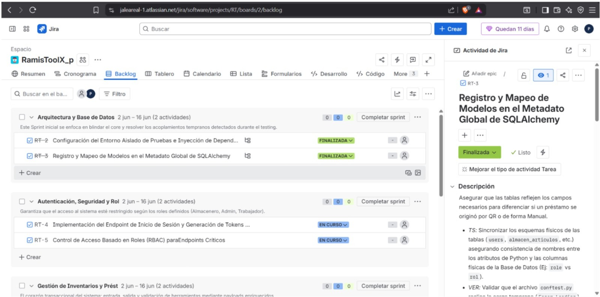
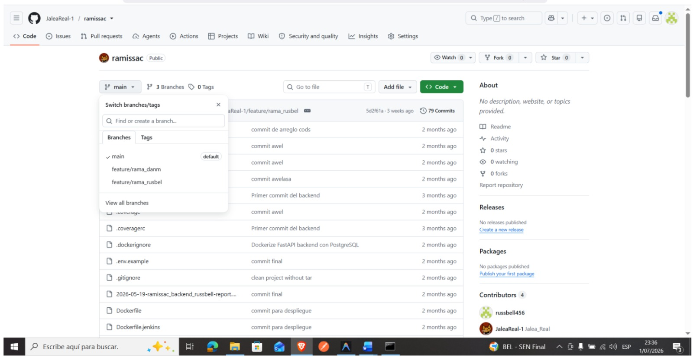
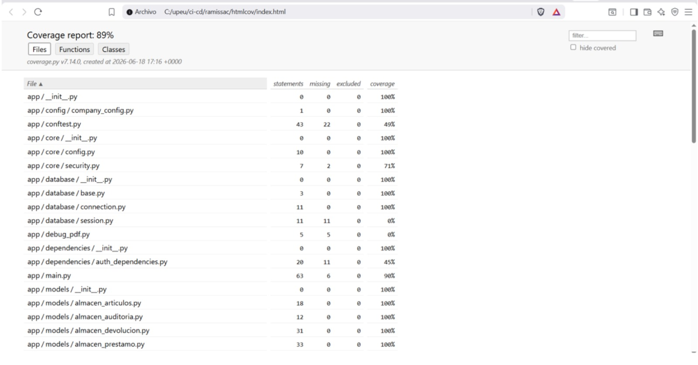
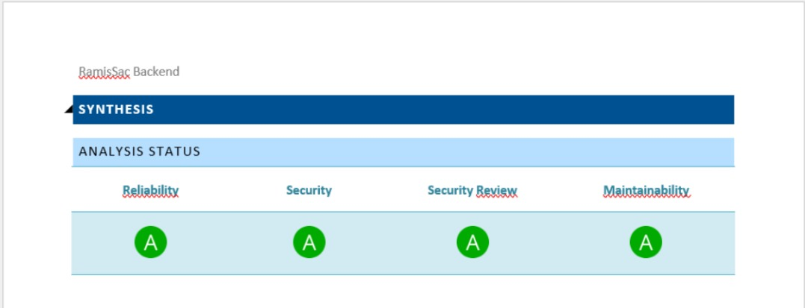
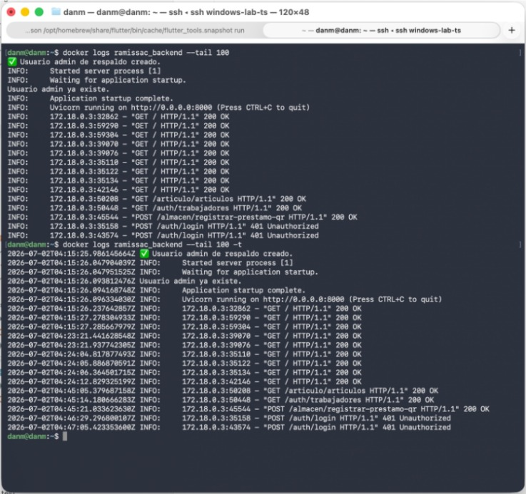
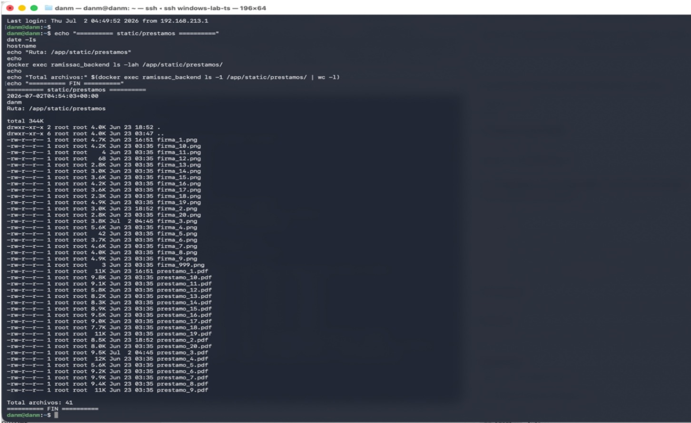
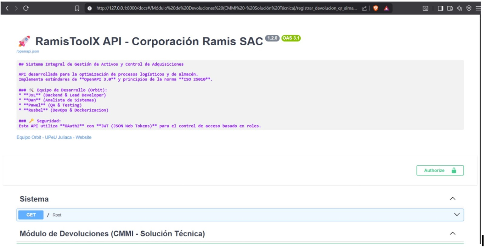

# Entregable N° 4: Registro de Evidencias de Auditoría (Fase 2)

**SISTEMA:** RamisToolX  
**ORGANIZACIÓN:** Startup Orbit  
**CÓDIGO DEL DOCUMENTO:** AUD-SDLC-RAMISTOOLX-2026-004-EVID  
**FECHA DE RECOPILACIÓN:** 15 de julio al 08 de agosto de 2026  

---

## 1. INTRODUCCIÓN Y METODOLOGÍA DE RECOPILACIÓN

Este documento compila de manera sistemática los artefactos, reportes y comprobaciones técnicas obtenidas durante la Fase 2 (Ejecución) de la auditoría del Ciclo de Vida de Desarrollo de Software (SDLC) de **RamisToolX**. Las evidencias han sido clasificadas y codificadas según las áreas de evaluación: Gestión de Requisitos (Jira/GitHub), Calidad de Código (SonarCloud), Seguridad (Snyk) e Infraestructura de Despliegue (Servidor Privado).

---

## 2. COMPILACIÓN SISTEMÁTICA DE EVIDENCIAS

### EVIDENCIA A: Trazabilidad de Requisitos y Gestión de Sprints (Jira y GitHub)

* **Código de Evidencia:** EVID-REQ-001
* **Área Evaluada:** Gestión de Requisitos (Metodología Scrum / CMMI-DEV v1.3)
* **Descripción:** Verificación del estado "Done" en las Historias de Usuario dentro del tablero Jira de la Startup Orbit, constatando la definición de criterios de aceptación y su vinculación con los Pull Requests correspondientes en GitHub.

**CAPTURA DE PANTALLA N° 01:** Tablero Scrum de Jira mostrando el Sprint finalizado.

> **Análisis del Auditor (Reginaldo Dan Mayhuire):** Se constata una trazabilidad directa entre la planificación de requerimientos y las ramas de desarrollo. Las políticas de Git Flow exigen un identificador de Jira en cada commit.

---

### EVIDENCIA B: Cumplimiento de Políticas de Revisión por Pares (Peer Review)

* **Código de Evidencia:** EVID-QA-002
* **Área Evaluada:** Verificación (CMMI-DEV VER)
* **Descripción:** Inspección de la configuración de ramas en GitHub, comprobando la restricción activa que impide fusiones directas a la rama principal (`main` o `master`) sin la aprobación de al menos dos revisores técnicos del equipo (Russbel, Pawel o Dan).

**CAPTURA DE PANTALLA N° 03:** Pull Request en GitHub donde se observen las firmas digitales de aprobación de los miembros asignados a la revisión por pares antes del Merge.

---

### EVIDENCIA C: Análisis Estático de Calidad y Mantenibilidad (SonarCloud .jar)

* **Código de Evidencia:** EVID-QUAL-003
* **Área Evaluada:** Verificación de Código y Deuda Técnica
* **Descripción:** Capturas de los documentos de texto (Word) y hojas de cálculo (Excel) extraídos mediante el componente ejecutable `.jar` de SonarCloud. Se evidencia el cumplimiento del **89% de cobertura de código (Code Coverage)** logrado a través de las pruebas automatizadas con Pytest, así como las métricas de mantenibilidad y confiabilidad ("Rating A").

**CAPTURA DE PANTALLA N° 04:** Reporte consolidado en Excel exportado de SonarCloud mostrando la métrica oficial de 89% de Code Coverage.

**CAPTURA DE PANTALLA N° 05:** Documento Word extraído del `.jar` donde se listen los índices de Deuda Técnica, Code Smells y el estado de los Quality Gates en 'Passed'.

> **Análisis del Auditor (Pawel Armando Paricahua):** Los datos demuestran un incremento robusto en la calidad frente a iteraciones anteriores. El 89% cubre los módulos críticos de negocio de FastAPI y las vistas en Flutter.

---

### EVIDENCIA D: Análisis de Seguridad de Dependencias (Snyk JSON)

* **Código de Evidencia:** EVID-SEC-004
* **Área Evaluada:** Seguridad de Software y Mitigación de Riesgos
* **Descripción:** Inspección técnica del archivo estructurado en formato JSON exportado por la herramienta Snyk durante el escaneo automatizado del backend de la aplicación. Se analiza la identificación y nivel de severidad de vulnerabilidades en las librerías de Python.

**CAPTURA DE PANTALLA N° 06:** Fragmento del archivo JSON de Snyk abierto en un editor de código (VS Code), resaltando las claves `severity`, `title` y el estado de remediación de paquetes de FastAPI.

---

### EVIDENCIA E: Entorno de Producción y Configuración en Servidor Privado

* **Código de Evidencia:** EVID-INF-005
* **Área Evaluada:** Solución Técnica e Integración del Producto (CMMI-DEV TS / IP)
* **Descripción:** Verificación del correcto despliegue del sistema RamisToolX en el **Servidor Privado** de la organización. Se audita la inicialización del servicio de FastAPI mediante Uvicorn, las variables de entorno aisladas y la persistencia en base de datos.

**CAPTURA DE PANTALLA N° 07:** Consola SSH conectada al Servidor Privado mostrando la ejecución exitosa del backend en FastAPI y los logs de atención de peticiones en tiempo real.

---

### EVIDENCIA F: Persistencia de Actas PDF y Carga Masiva

* **Código de Evidencia:** EVID-STG-006
* **Área Evaluada:** Procesamiento de Datos y Almacenamiento Seguro
* **Descripción:** Comprobación del guardado físico de las actas de préstamo generadas en formato PDF dentro de los directorios absolutos del Servidor Privado y pruebas de ejecución del script de procesamiento para la carga masiva de inventarios a través de archivos Excel.

**CAPTURA DE PANTALLA N° 08:** Estructura de directorios en el servidor privado mediante SFTP / Terminal, listando los archivos PDF de las actas generadas.

**CAPTURA DE PANTALLA N° 09:** Interfaz interactiva de Swagger/OpenAPI o log del sistema confirmando la carga exitosa y procesamiento sin errores.

> **Análisis del Auditor (Russbel Daniel Cari):** La transición al Servidor Privado resolvió las limitaciones de almacenamiento y rutas relativas. Las actas PDF se guardan con codificación de seguridad y la lógica de carga masiva en Excel valida excepciones de tipos de datos de forma correcta.

---

## 3. CONCLUSIÓN DEL REGISTRO

Las evidencias presentadas certifican que el equipo **Startup Orbit** ha ejecutado las actividades de ingeniería de acuerdo con los estándares establecidos. El descarte del entorno Termux por el **Servidor Privado** dota al sistema de mayor estabilidad y viabilidad técnica para la Corporación Ramis SAC.

  

**Firmas del Equipo Auditor:**

 

______________________________________  
**Russbel Daniel Cari Mamani** *Auditor de Infraestructura y Despliegue*

 

______________________________________  
**Pawel Armando Paricahua Adco** *Auditor de Calidad y QA*

 

______________________________________  
**Reginaldo Dan Mayhuire Buendia** *Auditor de Gestión y Seguridad*