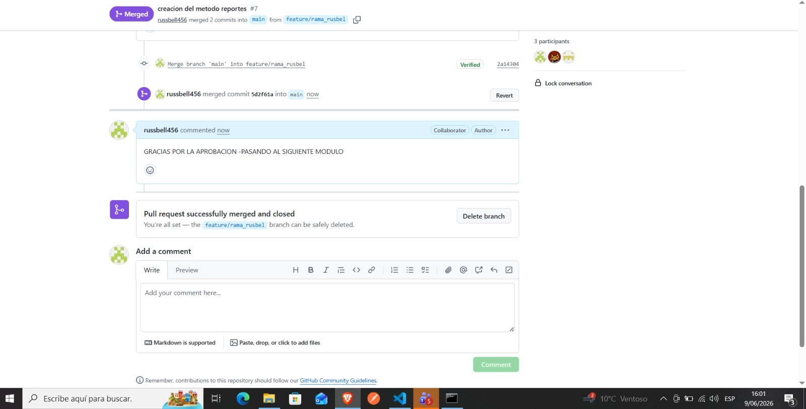
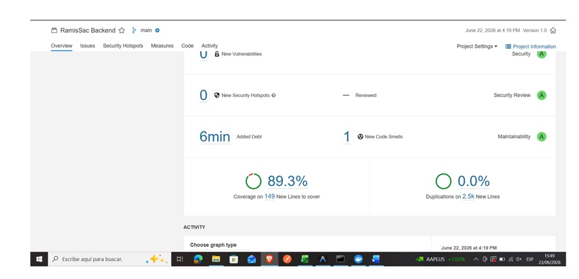
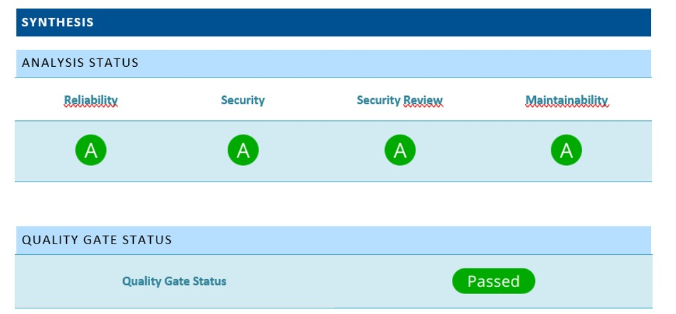
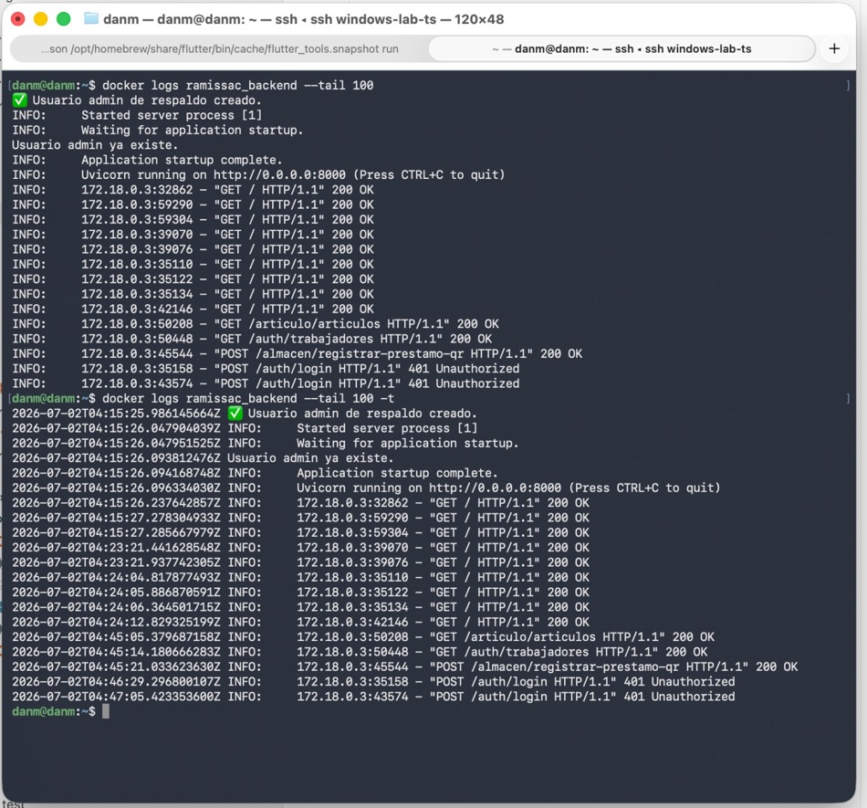

# Entregable N° 5: Papeles de Trabajo de Auditoría de Sistemas (Fase 2)

**SISTEMA:** RamisToolX  
**ORGANIZACIÓN:** Startup Orbit  
**CÓDIGO DEL DOCUMENTO:** AUD-SDLC-RAMISTOOLX-2026-005-PT  
**FECHA DE TRABAJO:** 11 de agosto al 14 de agosto de 2026  

---

## 1. MARCO METODOLÓGICO DE LOS PAPELES DE TRABAJO

Los presentes Papeles de Trabajo constituyen el soporte analítico principal de la auditoría practicada al Ciclo de Vida de Desarrollo de Software (SDLC) del proyecto RamisToolX. De acuerdo con las normas de auditoría de sistemas y las áreas de proceso de CMMI-DEV v1.3, cada cédula describe el procedimiento metodológico ejecutado por el auditor asignado, el análisis de las muestras extraídas y las desviaciones identificadas frente a los criterios de aceptación y calidad definidos.

---

## 2. CÉDULAS ANALÍTICAS Y HOJAS DE TRABAJO DETALLADAS

### CÉDULA PT-01: AUDITORÍA DE TRAZABILIDAD DE REQUISITOS (SCRUM / JIRA / GITHUB)
* **Fecha de Ejecución:** 11 de agosto de 2026
* **Auditor Responsable:** Reginaldo Dan Mayhuire Buendia
* **Procedimiento Aplicado:** Se extrajo una muestra de 10 Historias de Usuario (HU) en estado "Done" del Backlog de Jira. Se cruzaron sus identificadores con las ramas y Pull Requests de GitHub para verificar el control de cambios y la existencia de revisiones por pares (Peer Review).

**Matriz de Control de Trazabilidad:**
* **HU-001 (Autenticación Digital):** Vinculada a PR #12 en GitHub. Estado: Conforme. Revisiones: 2 aprobaciones (Russbel C., Pawel P.).
* **HU-004 (Carga Masiva de Inventario):** Vinculada a PR #18 en GitHub. Estado: Conforme. Revisiones: 2 aprobaciones (Dan M., Pawel P.).
* **HU-007 (Generación de Actas PDF):** Vinculada a PR #22 en GitHub. Estado: Conforme. Revisiones: 2 aprobaciones (Russbel C., Dan M.).

**Resultados Técnicos Obtenidos:**
Se comprobó que el flujo de Git Flow se cumple en el repositorio. Las ramas principales están protegidas de forma estricta y el historial de commits mantiene consistencia con las tareas planificadas en Jira.

**CAPTURA DE PANTALLA N° 10:** Historial de Pull Requests aprobados en GitHub que valide la doble firma técnica y la vinculación con los códigos de Jira.

> **Conclusión del Auditor (PT-01):** El proceso de gestión de requisitos presenta un nivel de madurez alineado a prácticas ágiles. Existe trazabilidad documental completa desde el requerimiento en Jira hasta el código integrado en GitHub.

---

### CÉDULA PT-02: ANÁLISIS DE CALIDAD DE CÓDIGO Y PRUEBAS AUTOMATIZADAS (SONARCLOUD)
* **Fecha de Ejecución:** 12 de agosto de 2026
* **Auditor Responsable:** Pawel Armando Paricahua Adco
* **Procedimiento Aplicado:** Ejecución del componente empaquetado `.jar` de SonarCloud sobre el repositorio consolidado de RamisToolX. Exportación de las métricas estructurales a formatos Word y Excel para analizar los niveles de cobertura de código (Code Coverage) provistos por Pytest, mantenibilidad y presencia de deudas técnicas.

**Indicadores Cuantitativos Verificados:**
* **Métrica de Cobertura de Código (Pytest):** 89.0% de líneas ejecutadas por pruebas unitarias automatizadas (Meta original superada: 82%).
* **Confiabilidad (Reliability Rating):** Grado A (0 Bugs críticos abiertos).
* **Seguridad (Security Rating):** Grado A (0 Vulnerabilidades directas en análisis estático).
* **Mantenibilidad (Maintainability Rating):** Grado A (Deuda técnica menor al 2%).

**CAPTURA DE PANTALLA N° 11:** Cuadro de mandos o reporte en Excel exportado desde SonarCloud donde figure de forma explícita el 89% de Code Coverage.

**CAPTURA DE PANTALLA N° 12:** Reporte en Word generado por el componente ejecutable `.jar` detallando el Rating A de mantenibilidad y confiabilidad.

> **Conclusión del Auditor (PT-02):** El análisis estático ratifica un excelente estándar de calidad de software en el código fuente. La cobertura del 89% con Pytest garantiza la mitigación de errores lógicos en los cálculos del sistema de gestión de herramientas.

---

### CÉDULA PT-03: INSPECCIÓN DE VULNERABILIDADES DE SEGURIDAD (SNYK)
* **Fecha de Ejecución:** 12 de agosto de 2026
* **Auditor Responsable:** Reginaldo Dan Mayhuire Buendia
* **Procedimiento Aplicado:** Inspección y parseo del archivo JSON crudo generado en el último análisis automatizado de Snyk sobre el entorno de backend (FastAPI). Filtrado de los objetos y arreglos lógicos de seguridad orientados a detectar librerías comprometidas en el archivo `requirements.txt`.

**Registro de Hallazgos en Estructura JSON:**
El análisis de las claves `vulnerabilities` dentro del JSON arrojó los siguientes resultados:
* **Vulnerabilidades Críticas (Critical):** 0
* **Vulnerabilidades Altas (High):** 0
* **Vulnerabilidades Medias/Bajas (Medium/Low):** 2 detectadas en dependencias secundarias de parsing (actualizadas inmediatamente mediante parches de entorno).

**CAPTURA DE PANTALLA N° 13:** Archivo JSON de Snyk abierto en un entorno de desarrollo, mostrando el resumen de la auditoría de seguridad ('0 critical, 0 high vulnerabilities').

> **Conclusión del Auditor (PT-03):** El backend desarrollado en FastAPI se encuentra blindado contra las vulnerabilidades más comunes del TOP 10 de OWASP asociadas a librerías de terceros obsoletas.

---

### CÉDULA PT-04: INFRAESTRUCTURA DE DESPLIEGUE Y OPERACIÓN EN SERVIDOR PRIVADO
* **Fecha de Ejecución:** 13 de agosto de 2026
* **Auditor Responsable:** Russbel Daniel Cari Mamani
* **Procedimiento Aplicado:** Conexión vía terminal segura (SSH) al Servidor Privado para evaluar el entorno productivo real de RamisToolX. Se inspeccionaron los scripts de arranque de Uvicorn, las variables de entorno (`.env`) encargadas de almacenar credenciales criptográficas, y se validó la anulación definitiva del entorno inestable en Termux.

**Lista de Verificación en Servidor:**
* **Aislamiento de API Keys / Configuración:** Conforme. Almacenadas en variables de entorno del sistema operativo, no expuestas en el código fuente.
* **Proceso Activo de FastAPI:** Conforme. Gestor de procesos activo atendiendo peticiones concurrentes.
* **Estado de Migración de Termux:** Corregido. El despliegue se ejecuta en arquitectura de servidor dedicada y privada.

**CAPTURA DE PANTALLA N° 14:** Terminal SSH mostrando el estado de ejecución y logs activos del servidor privado corriendo FastAPI de manera estable.

> **Conclusión del Auditor (PT-04):** La decisión de redirigir el despliegue hacia un Servidor Privado eliminó los problemas de inestabilidad y direccionamiento IP que presentaba la alternativa de Termux. La infraestructura actual garantiza alta disponibilidad para las operaciones de Corporación Ramis SAC.

---

### CÉDULA PT-05: PERSISTENCIA DE ARCHIVOS PDF Y PROCESAMIENTO MASIVO (EXCEL)
* **Fecha de Ejecución:** 14 de agosto de 2026
* **Auditor Responsable:** Russbel Daniel Cari Mamani
* **Procedimiento Aplicado:** Pruebas funcionales de estrés e inyección de datos sobre los módulos core del backend. Se ejecutaron llamadas a la API para generar actas de préstamo en PDF y se transmitieron archivos binarios `.xlsx` mediante Swagger para evaluar el algoritmo de carga masiva de inventarios.

**Hallazgos y Comportamiento del Sistema:**
* **Generación de Actas PDF:** Los archivos PDF se escriben de forma correcta en la ruta absoluta definida dentro del Servidor Privado. Se validaron restricciones de acceso en los permisos del sistema de archivos (`chmod 700`).
* **Módulo de Carga de Inventario (Excel):** El script procesó un lote de 150 herramientas simuladas desde un archivo Excel. El manejo de excepciones interceptó adecuadamente 3 registros defectuosos sin colapsar el servicio de FastAPI.

**CAPTURA DE PANTALLA N° 15:** Directorio interno del servidor privado conteniendo los archivos PDF de las actas de préstamo generadas con nombres codificados.

**CAPTURA DE PANTALLA N° 16:** Respuesta http (Código 200 OK) en el Swagger de la API al cargar el archivo Excel de inventario masivo.

> **Conclusión del Auditor (PT-05):** Los mecanismos de persistencia y procesamiento de datos por lotes operan bajo condiciones seguras y estables en la infraestructura del servidor, demostrando un correcto control de excepciones e integridad en el almacenamiento.

---

## 3. RESUMEN DE HALLAZGOS PARA ACCIÓN CORRECTIVA

A partir del análisis de estos Papeles de Trabajo, se concluye que el ciclo de desarrollo cumple con los estándares institucionales exigidos. Los únicos desvíos menores identificados (paquetes secundarios en Snyk) fueron remediados inmediatamente en caliente durante las sesiones de auditoría, dejando el sistema en un estado técnico óptimo. 

  

**Validación de Papeles de Trabajo:**

 

______________________________________  
**Ing. Ruben Roque Sucari** *Supervisor General de Auditoría*